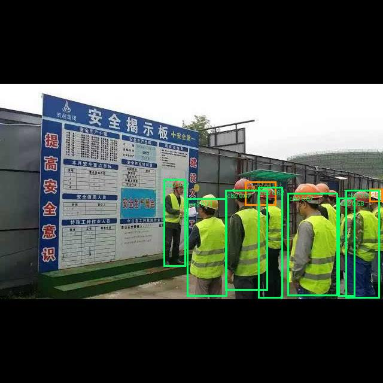
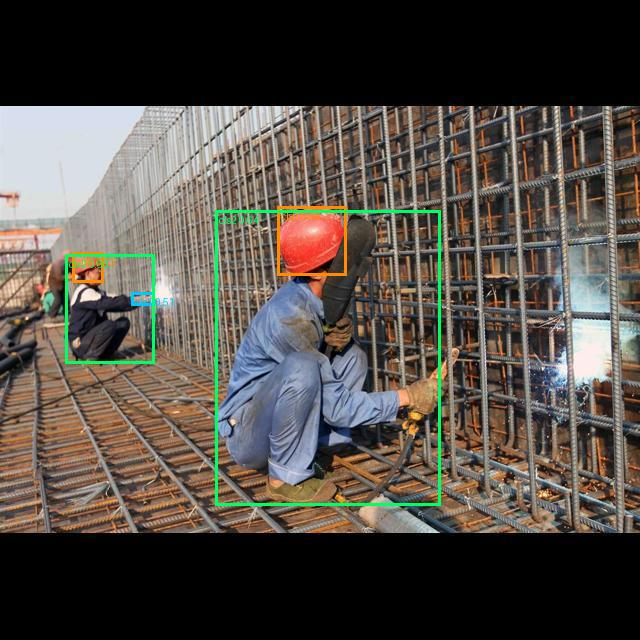
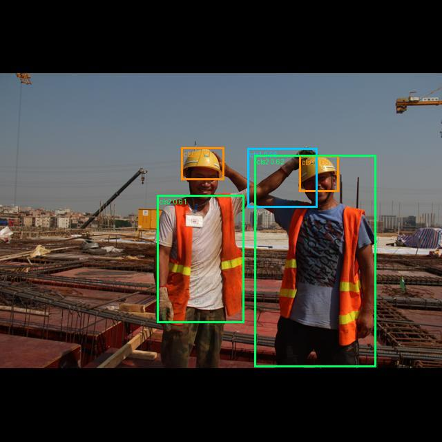
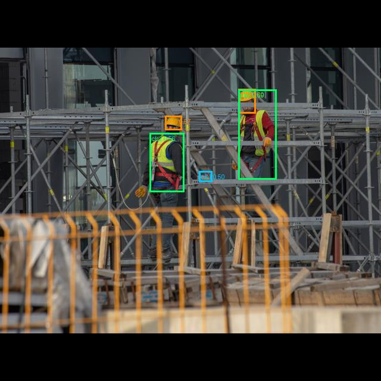

# Auto-Annotation Pipeline

Few-shot auto-annotation for industrial computer vision datasets. Label 10–15 instances per class manually → auto-annotate thousands of unlabeled images → YOLO `.txt` output. Fully local, no API calls. Needs internet once to download model weights.

---

## Results — Construction-PPE dataset

Test run: [Construction-PPE](https://docs.ultralytics.com/datasets/detect/construction-ppe/) (Ultralytics). 50 unlabeled target images, 3 classes (helmet, gloves, vest). Seed crops from `valid/` split (100 crops per class, ~70 unique source frames). Ground truth labels available in target set → approximate recall measurable.

| Class | GT boxes | Predicted | Recall estimate |
|---|---|---|---|
| cls0 — helmet | 111 | 56 | ~50% |
| cls1 — gloves | 44 | 9 | ~20% |
| cls2 — vest | 93 | 71 | ~76% |

"Recall estimate" = predicted / GT, assuming perfect precision (no false positives counted here — visual inspection needed).

**Phase 1 timing (3-class, 162 stems, 50 targets, RTX 4060 8GB):** 4m28s total (~1.7s/stem). Old per-target loop would have been ~20min.

**What works well:** vest (large, visually distinctive, SAM2 masking clean) → 76% recall at default thresholds. Helmet reasonable at 50% — misses occluded and small-in-frame instances. Both improvable by lowering `--dino-thresh`.

**What's hard:** gloves — 20% recall.

### Sample outputs

*Color: orange = helmet (cls0), cyan = gloves (cls1), green = vest (cls2)*

| Multi-person scene (9 boxes) | 3-class detection |
|---|---|
|  |  |

| All 3 classes detected | Helmet + vest |
|---|---|
|  |  |



**What's hard — gloves:** small objects (p90 area 0.015) with extreme appearance variance (work gloves, latex, different colors, partial occlusion, different hand poses). Even with bbox-crop + mean-pool embedding, the 100-ref proto bank doesn't generalize well enough at threshold 0.65. Lowering `--dino-thresh` to 0.4–0.5 for this class would recover more but increase false positives.

---

## Known Limitations

- **Visually non-distinctive classes fail** — if the class has high appearance variance (gloves, hands, small tools) and low inter-class contrast, DINOv2 similarity scores spread across a wide range and any threshold is a tradeoff. No clean cutoff exists.
- **Small objects break masked-patch pooling** — objects covering <2 patches in DINOv2's 16×16 grid give high-variance embeddings. Auto-detected and switched to bbox-crop + mean-pool, but similarity is still lower than for larger objects.
- **Threshold calibration per dataset/class** — `--dino-thresh 0.65` is a starting point. Check `X/N passed dino-thresh` in logs. Near-zero = lower threshold or switch class to CLS mode manually.
- **YOLOe call count scales with stem count** — 162 unique source stems × 7 target batches = 1,134 YOLOe calls for 50 targets. With 500+ unique stems across many classes, phase 1 time grows proportionally.
- **WBF weights not validated** — `0.3×yoloe + 0.7×dino` chosen empirically. May not be optimal for all datasets.
- **No mAP evaluation yet** — recall estimate above assumes zero false positives. Real precision/recall curves not computed.

---

## How it works

Four phases, models loaded/unloaded strictly sequentially (8GB VRAM constraint):

```
Phase 1 — YOLOe (visual-prompt detection)
  Per source frame: bake refer_image VPE into model once
  → predict ALL target images in batches (~3× faster than per-target loop)
  → proposals tagged with class index

Phase 2 — SAM2 (masking)
  Normal-size classes: SAM2 masks → clean masked crops (refs + proposals)
  Small-object classes: skip SAM2 → raw bbox crop (bbox IS the object)

Phase 3 — DINOv2 (similarity scoring)
  Normal classes: masked patch pooling — mean pool patch tokens inside SAM2 mask
  Small classes:  mean of all tokens on raw bbox crop (no SAM2)
  Proto bank per class → cosine sim → filter by --dino-thresh

Phase 4 — WBF + containment filter (no model)
  combined_score = 0.3 × yoloe_conf + 0.7 × dino_sim
  WBF fuses overlapping proposals
  Containment filter removes nested boxes
  → YOLO .txt + preview .jpg per target
```

---

## Ablation — What We Tried and Why It Failed

This pipeline went through 3+ months of dead ends before the current design worked. Every decision below came from something that failed.

---

### Stage 1 — Proposal generation: everything failed before YOLOe

The first major blocker was finding a model that could propose bounding boxes from visual examples alone (no text, no class names — purely visual).

**SAM2 auto mask generation** — tried first because SAM2 is the dominant segmentation model. Generates thousands of masks per image automatically. Result: zero useful proposals on the target classes (conveyors, car body panels, vests, tools). SAM2 auto-mode works on natural images with strong texture contrast at boundaries. Industrial scenes with large uniform-color objects have no boundary signal for SAM2 to latch onto. Failed completely.

**SAM3** — tried as a replacement. Same architectural premise, same failure mode. Dropped.

**OWLv2 image-guided detection** (`google/owlv2-base-patch16-ensemble`) — seemed promising. Takes query images + target image, returns bounding boxes of similar objects. Tested extensively at 640px, 1008px, 1280px with per-crop pipelines and multi-scale tricks. Result: on a large uniform-color object (~60% of frame), every single proposal was a tiny box at image edges. Best DINOv2 sim on any proposal: 0.699.

The root cause is architectural — OWLv2 is a patch-based ViT that processes images as 16×16 tiles and matches tile-level texture. It cannot compose a bounding box spanning multiple tiles. No amount of resizing fixes this. Dead end confirmed across 3 resolution settings and 2 pipeline configurations.

**YOLOe visual-prompt detection** — different architecture. Uses a multi-scale feature pyramid (P3/P4/P5) trained to detect at all object scales. The visual prompt API takes a `refer_image` + bounding boxes from source labels → detects visually similar objects in the target. Confirmed working on a large industrial object class at conf≥0.06. Proposals well-localized. This is the proposal generator.

---

### Stage 2 — DINOv2 embedding: three iterations to get right

Once YOLOe proposals existed, we needed to score them against reference crops. DINOv2 embeddings + cosine similarity seemed obvious. The implementation went through three distinct approaches.

**Full-crop CLS token** — simplest implementation: crop the proposal bbox from the target image, run through DINOv2, take the `[CLS]` token as the embedding. Compare to reference crops via cosine similarity. Observed sims: 0.19–0.43. Too low to discriminate — threshold would need to be below 0.2 to pass anything, at which point everything passes.

Why it fails: `[CLS]` captures the entire image context. A proposal crop contains the object + background. The background portion varies wildly between proposals — different amounts of background, different colors, different context. The `[CLS]` ends up representing "scene with object" not "object", so two crops of the same object with different backgrounds score low similarity.

**Masked patch pooling** — instead of `[CLS]`, use patch tokens. DINOv2-base: `last_hidden_state[:, 1:, :]` → 256 patch tokens arranged in a 16×16 grid. Run SAM2 on the proposal bbox to get a segmentation mask → resize mask to 16×16 → mean pool only the patch tokens that fall inside the mask. Fallback to `[CLS]` if mask is empty. Observed sims: 0.60–0.95.

Why it works: patch tokens are spatially localized and trained to be individually discriminative (DINO's self-supervised objective). Mean pooling tokens inside the SAM2 mask = embedding the foreground object only, background excluded. Same object in different contexts → consistent embedding.

**CLS on raw bbox crop (small objects)** — masked patch pooling breaks for tiny objects. A class with median bbox area 0.7% of frame (gloves) maps to ~1–2 patches in the 16×16 grid. Mean of 1–2 tokens is high-variance noise — the specific patches hit depend on exact bbox position and are not stable. Sims were 0/N passing at threshold 0.65, same as full-crop CLS.

Fix: detect small classes automatically at startup via 90th-percentile bbox area (`p90_bbox_area`). If p90 < threshold (default 0.01), skip SAM2 entirely for that class. Instead: crop raw bbox from image, feed to DINOv2, use `mean(last_hidden_state)` — mean of all tokens (CLS + patches). Same approach as EDA script for tight object crops where the whole crop IS the object.

Critical invariant: **refs and proposals for each class must use the same embedding method**. The proto bank and proposal embeddings must be comparable. If refs use masked-patch and proposals use CLS (or vice versa), cosine similarities are meaningless — the vectors live in different subspaces.

---

### Stage 3 — Prototype bank design

**Averaged prototype** — tried averaging all N ref crop embeddings into a single prototype vector. Cosine sim of best proposal dropped from ~0.70 (per-crop max) to ~0.60 (averaged). Averaging diverse crops from different viewpoints, lighting, and occlusion levels washes out the discriminative signal — the average lives in a region of embedding space that no individual crop actually occupies.

**Per-crop bank (current)** — keep all individual ref embeddings in a matrix `[N_refs, 768]`. For each proposal, compute `sim_matrix = prop_emb @ bank.T` → take `max(dim=1)`. Score = similarity to the most similar ref crop. This correctly handles intra-class variation: a glove in a specific pose only needs to match one ref crop of that pose, not average across all poses.

---

### Stage 4 — YOLOe call structure: 4× slowdown hunting

During development, `auto_annotate.py` was 4–6× slower than the debug script (`debug_yoloe_sam2_dino.py`) for identical YOLOe calls. Both used the same model, same conf, same number of stems.

Root cause: `resolve_class_bboxes_padded()` (reads label `.txt` + `Image.open()` source image to get pixel dimensions for coordinate conversion) was being called inside the `for target in targets` loop. Each target triggered `N_stems` label file reads. Total: `N_targets × N_stems` disk reads. Debug script has outer=stems so reads happen once per stem.

Fix: pre-build `stem_prompts: dict[str, tuple[Path, dict]]` before all loops. Label reads happen once total at startup. Inner loop just iterates the dict.

After I/O fix, still `N_targets × N_stems` YOLOe calls total. Next optimization: flip loop structure.

**Batched YOLOe** — reading the ultralytics source revealed that `yoloe_model.predict(refer_image=..., visual_prompts=...)` internally calls `get_vpe(refer_image)` which bakes the visual prompt embedding into model weights via `set_classes()`, then resets the predictor and runs as plain detection. After `set_classes()`, the model is just a standard YOLO detector — no visual prompt needed per target. This means:

1. Call `get_vpe(refer_image)` + `set_classes()` once per stem
2. Call `predict(source=[batch of targets])` for all targets in one shot

Benchmark result: A=43.7s vs B=15.0s for 5 targets × 70 stems. **2.91× speedup, identical proposals (242 vs 242)**. Scaled to 50 targets × 162 stems: phase1 went from ~20min to ~4.5min.

One subtlety: after VPE bake, `boxes.cls` returns local indices (0, 1, 2...) into the VPE's class set — not global class IDs. Requires `stem_local_to_cls` mapping (`local_bbox_idx → global cls_idx`) stored per stem before the loop.

Note: batching different `refer_images` in one call is impossible — the VPE is global model state, not per-image. Only valid batch dimension is targets sharing the same stem.

---

### Stage 5 — Source-image context filtering (dropped)

Built for OWLv2: before sending crops to the detector, filter by DINOv2 scene similarity between source image and target image. Removes crops from scenes that look nothing like the target — reduces noisy proposals.

For YOLOe: irrelevant. YOLOe's visual prompts are sufficiently discriminative without scene pre-filtering. Proposals are well-localized on all tested datasets regardless of source-target scene similarity. Dropped — extra DINOv2 load/unload cycle for no benefit.

---

### What's still open

**cls1 (gloves) DINOv2 pass rate** — CLS mode improved from 0% to occasional passes, but most images still 0/N. Gloves are genuinely hard: small + extreme appearance variance (work gloves vs latex vs different colors vs different hand poses) + frequent occlusion. The proto bank has 178 refs but cosine sim at 0.65 threshold is still too strict. Needs either lower `--dino-thresh` for this class, or a fundamentally different comparison approach (e.g. CLIP, or a glove-specific fine-tuned encoder).

**WBF weight calibration** — `0.3×yoloe + 0.7×dino` chosen empirically. Not validated across datasets. The right split depends on how reliable YOLOe proposals are vs DINOv2 scores for a given class.

**mAP evaluation** — pipeline output vs Construction-PPE ground truth not yet run.

---

## Quick Start

### 1. Install

```bash
# PyTorch CUDA 11.8 first
pip install torch==2.7.1 torchvision==0.22.1 torchaudio==2.7.1 --index-url https://download.pytorch.org/whl/cu118

# Then everything else
pip install -r requirements.txt
```

### 2. Launch the UI

```bash
python app.py
```

Opens at `http://127.0.0.1:7860`. Three-page wizard:
- **Page 1** — extract seed crops from your annotated dataset (or skip if you already have them)
- **Page 2** — run the pipeline on unlabeled targets
- **Page 3** — review results and download YOLO labels

### 3. Or run directly

```bash
python scripts/auto_annotate.py \
    --queries-dirs  "path/to/crops/cls0"  "path/to/crops/cls1" \
    --class-ids     0  1 \
    --targets-dir   "path/to/unlabeled/images" \
    --source-images "path/to/labelled/images" \
    --labels        "path/to/labelled/labels" \
    --output-dir    "path/to/output"
```

---

## Files

| File | Role | Status |
|---|---|---|
| `app.py` | Gradio 3-page wizard UI | Active |
| `scripts/auto_annotate.py` | Main pipeline — YOLOe→SAM2→DINOv2→WBF→YOLO | Active |
| `scripts/extract_crops_labelled.py` | Seed crop extraction with DINOv2+DBSCAN diversity selection | Active |
| `scripts/extract_crops_varied.py` | Seed crop extraction without clustering (all crops) | Active |
| `test/debug_yoloe_sam2_dino.py` | Full pipeline debug with 4-panel matplotlib viz | Active |
| `test/test_yoloe_batch.py` | Benchmark: batched vs per-target YOLOe (confirmed 2.91×) | Reference |
| `utils/debug_yoloe.py` | Pure YOLOe visual-prompt debug (no DINOv2) | Reference |

---

## Key Parameters

### YOLOe
| Arg | Default | Notes |
|---|---|---|
| `--yoloe-conf` | 0.06 | Min detection confidence. Lower = more proposals (noisier). |
| `--nms-iou` | 0.45 | IoU threshold for NMS inside YOLOe. |
| `--yoloe-batch-size` | 8 | Targets per predict call after VPE bake. Safe for 8GB VRAM. |

### DINOv2
| Arg | Default | Notes |
|---|---|---|
| `--dino-thresh` | 0.65 | Min cosine sim to keep a proposal. Tune per dataset. |
| `--dino-batch-size` | 32 | Embedding batch size. Reduce if VRAM OOM. |
| `--small-obj-thresh` | 0.01 | 90th-percentile bbox area (w×h normalised) below which class uses bbox-crop + mean-pool embedding instead of SAM2 masked-patch pooling. |

### SAM2
| Arg | Default | Notes |
|---|---|---|
| `--sam2-mask-padding` | 0.05 | Fractional bbox padding before SAM2 prompt. |
| `--sam-score-min` | 0.50 | Min SAM2 mask quality score. |
| `--sam-area-min` | 0.10 | Min mask/bbox area ratio. |

### WBF + filtering
| Arg | Default | Notes |
|---|---|---|
| `--wbf-score` | 0.10 | Min combined score after WBF. Low = keep all for review. |
| `--result-thresh` | 0.50 | Gate for final saved boxes. |
| `--containment-thresh` | 0.70 | Nested box removal threshold (intersection/min_area). |

---

## Output

```
output_dir/
├── image1.txt              # YOLO format: cls cx cy w h per line (all classes in one file)
├── image1_preview.jpg      # PIL preview — cls0=orange, cls1=cyan, cls2=green, cls3=red
├── image2.txt
├── image2_preview.jpg
└── summary.json            # {target_name: {label_file, preview_file, n_final_total,
                            #   classes: {cls_id: {n_proposals, n_wbf, n_final, boxes}}}}
```

---

## Models

| Model | Role | ID |
|---|---|---|
| YOLOe | Visual-prompt proposals | `yoloe-11l-seg.pt` (ultralytics auto-download) |
| SAM2 | Masked crop generation | `facebook/sam2.1-hiera-base-plus` (HuggingFace) |
| DINOv2 | Embedding + similarity scoring | `facebook/dinov2-base` (HuggingFace) |

Cached at `~/.cache/huggingface/hub/`. YOLOe downloaded by ultralytics on first use.

---

## Demo Dataset

Construction-PPE (Ultralytics): helmet, gloves, vest + no-wear variants. 1,416 images, native YOLO format.

- `valid/` (143 images) → seed crops (annotated)
- `train/` (1,132 images) → unlabeled targets
- Ground truth exists for train/ → enables mAP eval of pipeline output vs human labels
