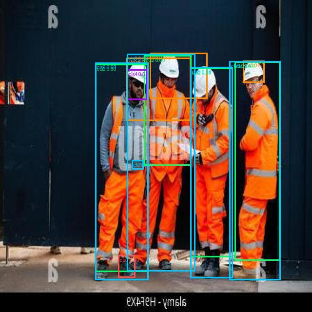
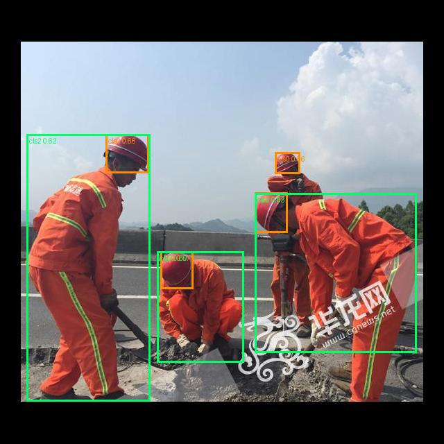
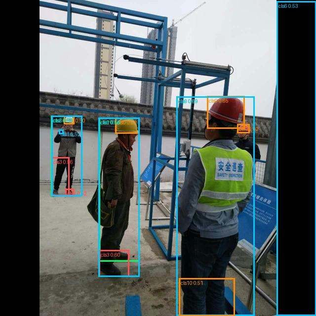
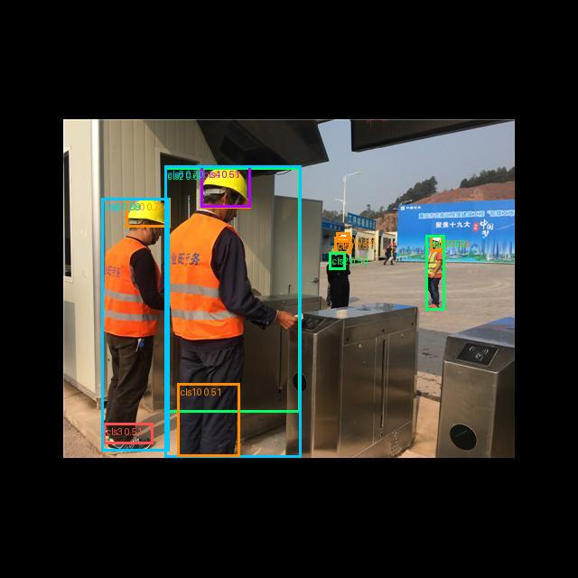
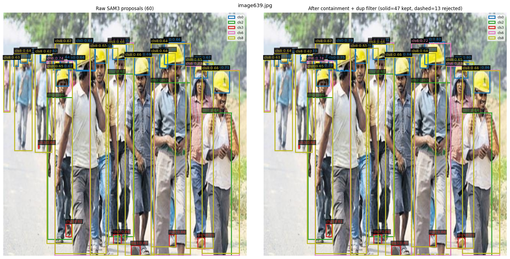
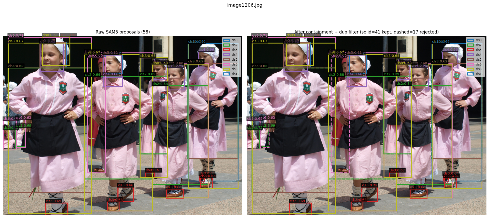

# Auto-Annotation Pipeline

Few-shot auto-annotation for industrial computer vision datasets. Label 10–15 instances per class manually → auto-annotate thousands of unlabeled images → YOLO `.txt` output. Fully local, no API calls. Needs internet once to download model weights.

---

## Results — Construction-PPE dataset - Pipeline A

Dataset: [Construction-PPE](https://docs.ultralytics.com/datasets/detect/construction-ppe/) (Ultralytics). Eval on 50-image subset with ground truth using `scripts/eval_map.py`.

**Setup:** 1,132 source frames (stride=2 → 566 frames sampled) → 100 crops/class after DINOv2+DBSCAN diversity selection. 380 unique source stems across 10 classes. 50 unlabeled target images. Hardware: RTX 4060 Laptop 8GB VRAM.

**Parameters:** `--yoloe-conf 0.06 --dino-thresh 0.50 --small-obj-thresh 0.02 --result-thresh 0.50 --containment-thresh 0.70`

**Timing (end-to-end):**
- Phase 1 — YOLOe: 11m02s — 380 stems, 17,668 proposals across 50 targets (~1.74s/stem)
- Phase 2 — SAM2: 14m55s — SAM2 chunked to 50 boxes/call (OOM fix for images with 300+ proposals)
- Phase 3+4 — DINOv2 + WBF: remainder
- **Total: 19m41s** for 50 targets × 10 classes

| Class | Prec | Rec | F1 | AP@.50 | AP@.5:.95 | nPred | nGT |
|---|---|---|---|---|---|---|---|
| helmet (cls0) | 0.542 | 0.405 | 0.464 | 0.323 | 0.105 | 83 | 111 |
| gloves (cls1) | 0.138 | 0.091 | 0.110 | 0.053 | 0.018 | 29 | 44 |
| vest (cls2) | 0.600 | 0.516 | 0.555 | 0.367 | 0.151 | 80 | 93 |
| boots (cls3) | 0.188 | 0.231 | 0.207 | 0.102 | 0.034 | 48 | 39 |
| goggles (cls4) | 0.023 | 0.111 | 0.038 | 0.119 | 0.024 | 43 | 9 |
| none (cls5) | 0.000 | 0.000 | 0.000 | N/A | N/A | 0 | 20 |
| Person (cls6) | 0.812 | 0.600 | 0.690 | 0.559 | 0.228 | 85 | 115 |
| no_helmet / no_goggle / no_gloves / no_boots | — | — | — | — | — | 0 | 0 GT in eval split |
| **mAP@.50** | | | | **0.254** | **0.093** | 427 | 431 |

mAP averaged over 7 classes with GT present. Classes with 0 GT excluded per COCO convention.

**What works:**
- **Person (cls6):** 0.690 F1, AP=0.559. Large object, SAM2 masking effective, DINOv2 discriminative.
- **Vest (cls2):** 0.555 F1. Large, visually distinctive. SAM2 masked-patch pooling gives clean embeddings.
- **Helmet (cls0):** 0.464 F1. Multi-person crowd images tank recall — `image117`, `image144`, `image182` all heavily missed.

**What's hard:**
- **Gloves (cls1):** 9.1% recall. Small (p90 area=0.015), extreme appearance variance. CLS-mode embedding (correct routing) still spreads too wide for clean threshold separation.
- **Goggles (cls4):** 43 preds, prec=0.023 — near-total FP flood. YOLOe fires on anything goggle-shaped; per-class confidence tuning needed.
- **Boots (cls3):** FP-heavy (prec=0.188). Similar cause.
- **`none` (cls5):** 0 proposals. Background/negative class has no coherent visual prototype — YOLOe cannot propose it.

### Sample outputs

*Colors: orange=helmet(0) cyan=gloves(1) green=vest(2) red=boots(3) purple=goggles(4) white=Person(6) dark-red=no_boots(10)*

| 6-class detection — 3 workers | Multi-person + road scene |
|---|---|
|  |  |

| Construction site — helmet+vest+boots+Person | Vest+helmet+goggles+boots+no_boots |
|---|---|
|  |  |

---

## Results — Construction-PPE dataset - Pipeline B (SAM3)

Dataset: same Construction-PPE source images. Eval on a **different, larger test set** than Pipeline A above — 150-image stratified sample (`data/test/`, moved out of `data/label/`) covering all 11 classes, including the `no_*` negative-state classes that had 0 GT in Pipeline A's 50-image eval split. **Numbers below are not directly comparable to Pipeline A's table above** — different image count, different class coverage. A same-set comparison needs Pipeline A re-run on `data/test/` too.

**⚠️ Note (2026-07-20):** table below predates DINOv2 masked-patch scoring, max-sim, and the current `--sam3-dino-thresh 0.2` default (all added/recalibrated 2026-07-20) — numbers are stale, from an earlier mean-sim/CLS-on-raw-crop/0.3-thresh configuration. Smoke-tested only since; full mAP re-run pending (see `docs/plans.md`).

**Command:** `python scripts/eval_map.py --preds output_sam3_dinov2_ppe/labels --gt data/test --images data/test --classes helmet gloves vest boots goggles none Person no_helmet no_goggle no_gloves no_boots`

| Class | Prec | Rec | F1 | AP@.50 | AP@.5:.95 | nPred | nGT |
|---|---|---|---|---|---|---|---|
| helmet (cls0) | 0.483 | 0.807 | 0.604 | 0.422 | 0.140 | 286 | 171 |
| gloves (cls1) | 0.306 | 0.500 | 0.379 | 0.163 | 0.039 | 252 | 154 |
| vest (cls2) | 0.262 | 0.455 | 0.332 | 0.174 | 0.046 | 233 | 134 |
| boots (cls3) | 0.245 | 0.307 | 0.273 | 0.128 | 0.033 | 208 | 166 |
| goggles (cls4) | 0.161 | 0.364 | 0.223 | 0.103 | 0.022 | 124 | 55 |
| none (cls5) | 0.082 | 0.195 | 0.115 | 0.030 | 0.007 | 208 | 87 |
| Person (cls6) | 0.665 | 0.797 | 0.725 | 0.570 | 0.218 | 266 | 222 |
| no_helmet (cls7) | 0.059 | 0.143 | 0.084 | 0.022 | 0.004 | 135 | 56 |
| no_goggle (cls8) | 0.000 | 0.000 | 0.000 | 0.000 | 0.000 | 224 | 45 |
| no_gloves (cls9) | 0.050 | 0.013 | 0.020 | 0.003 | 0.001 | 20 | 79 |
| no_boots (cls10) | 0.004 | 0.038 | 0.007 | 0.001 | 0.000 | 540 | 53 |
| **mAP@.50** | | | | **0.147** | **0.046** | 2496 | 1222 |

mAP averaged over all 11 classes (all have GT present in this 150-image set).

**What works:**
- **Person (cls6):** 0.725 F1, AP=0.570 — best class, consistent with Pipeline A.
- **Helmet (cls0):** 0.604 F1 — high recall (0.807) but precision only 0.483, more FPs than Pipeline A's helmet result.

**What's hard (as of the stale table above):**
- **`no_boots` (cls10):** prec=0.004 — 540 preds for 53 GT, near-total FP flood.
- **`no_goggle` (cls9):** 0 TP at all — 224 preds, all FP.
- **Negative-state classes generally weak** (`no_helmet`, `no_goggle`, `no_gloves`, `no_boots`): these classes are defined by *absence* of a visual feature, which is a poor match for SAM3's exemplar-based few-shot matching — same fundamental issue as `none` in Pipeline A. Whether the current DINOv2 masked-patch + max-sim scoring (added 2026-07-20) helps here is untested — pending mAP re-run.

### Sample outputs

*⚠️ Stale — samples below are from 2026-07-15, before the DINOv2 gate existed (added 2026-07-19) — 2-panel format: left = all raw SAM3 proposals color-coded by class, right = kept (solid) vs rejected (dashed) after containment+dup filter. Current pipeline produces a 3rd panel: kept (solid) vs rejected (dashed) after the DINOv2 sim gate, labeled with sim score. New samples pending re-run.*

| image639 (47 final boxes) | image1206 (41 final boxes) |
|---|---|
|  |  |

---

## Known Limitations

- **Visually non-distinctive classes fail** — if the class has high appearance variance (gloves, hands, small tools) and low inter-class contrast, DINOv2 similarity scores spread across a wide range and any threshold is a tradeoff. No clean cutoff exists.
- **Small objects break masked-patch pooling** — objects covering <2 patches in DINOv2's 16×16 grid give high-variance embeddings. Auto-detected and switched to bbox-crop + mean-pool, but similarity is still lower than for larger objects.
- **Threshold calibration per dataset/class** — `--dino-thresh 0.65` is a starting point. Check `X/N passed dino-thresh` in logs. Near-zero = lower threshold or switch class to CLS mode manually.
- **YOLOe call count scales with stem count** — 162 unique source stems × 7 target batches = 1,134 YOLOe calls for 50 targets. With 500+ unique stems across many classes, phase 1 time grows proportionally.
- **WBF weights not validated** — `0.3×yoloe + 0.7×dino` chosen empirically. May not be optimal for all datasets.
- **mAP evaluated via `scripts/eval_map.py`** — real P/R/F1/AP@.50/mAP@.5:.95 per class. See Results section above.

---

## How it works

Four phases, models loaded/unloaded strictly sequentially (8GB VRAM constraint):

```
Phase 1 — YOLOe (visual-prompt detection)
  Per source frame: bake refer_image VPE into model once
  → predict ALL target images in batches (~3× faster than per-target loop)
  → proposals tagged with class index

Phase 2 — SAM2 (masking)
  Normal-size classes: SAM2 masks → clean masked crops (refs + proposals)
  Small-object classes: skip SAM2 → raw bbox crop (bbox IS the object)

Phase 3 — DINOv2 (similarity scoring)
  Normal classes: masked patch pooling — mean pool patch tokens inside SAM2 mask
  Small classes:  mean of all tokens on raw bbox crop (no SAM2)
  Proto bank per class → cosine sim → filter by --dino-thresh

Phase 4 — WBF + containment filter (no model)
  combined_score = 0.3 × yoloe_conf + 0.7 × dino_sim
  WBF fuses overlapping proposals
  Containment filter removes nested boxes
  → YOLO .txt + preview .jpg per target
```

---

## Ablation — What We Tried and Why It Failed

This pipeline went through 3+ months of dead ends before the current design worked. Every decision below came from something that failed.

---

### Stage 1 — Proposal generation: everything failed before YOLOe

The first major blocker was finding a model that could propose bounding boxes from visual examples alone (no text, no class names — purely visual).

**SAM2 auto mask generation** — tried first because SAM2 is the dominant segmentation model. Generates thousands of masks per image automatically. Result: zero useful proposals on the target classes (conveyors, car body panels, vests, tools). SAM2 auto-mode works on natural images with strong texture contrast at boundaries. Industrial scenes with large uniform-color objects have no boundary signal for SAM2 to latch onto. Failed completely.

**SAM3 (auto mask generation)** — tried as a replacement. Same architectural premise, same failure mode. Dropped.

**OWLv2 image-guided detection** (`google/owlv2-base-patch16-ensemble`) — seemed promising. Takes query images + target image, returns bounding boxes of similar objects. Tested extensively at 640px, 1008px, 1280px with per-crop pipelines and multi-scale tricks. Result: on a large uniform-color object (~60% of frame), every single proposal was a tiny box at image edges. Best DINOv2 sim on any proposal: 0.699.

The root cause is architectural — OWLv2 is a patch-based ViT that processes images as 16×16 tiles and matches tile-level texture. It cannot compose a bounding box spanning multiple tiles. No amount of resizing fixes this. Dead end confirmed across 3 resolution settings and 2 pipeline configurations.

**YOLOe visual-prompt detection** — different architecture. Uses a multi-scale feature pyramid (P3/P4/P5) trained to detect at all object scales. The visual prompt API takes a `refer_image` + bounding boxes from source labels → detects visually similar objects in the target. Confirmed working on a large industrial object class at conf≥0.06. Proposals well-localized. This is the proposal generator.

---

### Stage 2 — DINOv2 embedding: three iterations to get right

Once YOLOe proposals existed, we needed to score them against reference crops. DINOv2 embeddings + cosine similarity seemed obvious. The implementation went through three distinct approaches.

**Full-crop CLS token** — simplest implementation: crop the proposal bbox from the target image, run through DINOv2, take the `[CLS]` token as the embedding. Compare to reference crops via cosine similarity. Observed sims: 0.19–0.43. Too low to discriminate — threshold would need to be below 0.2 to pass anything, at which point everything passes.

Why it fails: `[CLS]` captures the entire image context. A proposal crop contains the object + background. The background portion varies wildly between proposals — different amounts of background, different colors, different context. The `[CLS]` ends up representing "scene with object" not "object", so two crops of the same object with different backgrounds score low similarity.

**Masked patch pooling** — instead of `[CLS]`, use patch tokens. DINOv2-base: `last_hidden_state[:, 1:, :]` → 256 patch tokens arranged in a 16×16 grid. Run SAM2 on the proposal bbox to get a segmentation mask → resize mask to 16×16 → mean pool only the patch tokens that fall inside the mask. Fallback to `[CLS]` if mask is empty. Observed sims: 0.60–0.95.

Why it works: patch tokens are spatially localized and trained to be individually discriminative (DINO's self-supervised objective). Mean pooling tokens inside the SAM2 mask = embedding the foreground object only, background excluded. Same object in different contexts → consistent embedding.

**CLS on raw bbox crop (small objects)** — masked patch pooling breaks for tiny objects. A class with median bbox area 0.7% of frame (gloves) maps to ~1–2 patches in the 16×16 grid. Mean of 1–2 tokens is high-variance noise — the specific patches hit depend on exact bbox position and are not stable. Sims were 0/N passing at threshold 0.65, same as full-crop CLS.

Fix: detect small classes automatically at startup via 90th-percentile bbox area (`p90_bbox_area`). If p90 < threshold (default 0.01), skip SAM2 entirely for that class. Instead: crop raw bbox from image, feed to DINOv2, use `mean(last_hidden_state)` — mean of all tokens (CLS + patches). Same approach as EDA script for tight object crops where the whole crop IS the object.

Critical invariant: **refs and proposals for each class must use the same embedding method**. The proto bank and proposal embeddings must be comparable. If refs use masked-patch and proposals use CLS (or vice versa), cosine similarities are meaningless — the vectors live in different subspaces.

---

### Stage 3 — Prototype bank design

**Averaged prototype** — tried averaging all N ref crop embeddings into a single prototype vector. Cosine sim of best proposal dropped from ~0.70 (per-crop max) to ~0.60 (averaged). Averaging diverse crops from different viewpoints, lighting, and occlusion levels washes out the discriminative signal — the average lives in a region of embedding space that no individual crop actually occupies.

**Per-crop bank (current)** — keep all individual ref embeddings in a matrix `[N_refs, 768]`. For each proposal, compute `sim_matrix = prop_emb @ bank.T` → take `max(dim=1)`. Score = similarity to the most similar ref crop. This correctly handles intra-class variation: a glove in a specific pose only needs to match one ref crop of that pose, not average across all poses.

---

### Stage 4 — YOLOe call structure: 4× slowdown hunting

During development, `auto_annotate.py` was 4–6× slower than the debug script (`debug_yoloe_sam2_dino.py`) for identical YOLOe calls. Both used the same model, same conf, same number of stems.

Root cause: `resolve_class_bboxes_padded()` (reads label `.txt` + `Image.open()` source image to get pixel dimensions for coordinate conversion) was being called inside the `for target in targets` loop. Each target triggered `N_stems` label file reads. Total: `N_targets × N_stems` disk reads. Debug script has outer=stems so reads happen once per stem.

Fix: pre-build `stem_prompts: dict[str, tuple[Path, dict]]` before all loops. Label reads happen once total at startup. Inner loop just iterates the dict.

After I/O fix, still `N_targets × N_stems` YOLOe calls total. Next optimization: flip loop structure.

**Batched YOLOe** — reading the ultralytics source revealed that `yoloe_model.predict(refer_image=..., visual_prompts=...)` internally calls `get_vpe(refer_image)` which bakes the visual prompt embedding into model weights via `set_classes()`, then resets the predictor and runs as plain detection. After `set_classes()`, the model is just a standard YOLO detector — no visual prompt needed per target. This means:

1. Call `get_vpe(refer_image)` + `set_classes()` once per stem
2. Call `predict(source=[batch of targets])` for all targets in one shot

Benchmark result: A=43.7s vs B=15.0s for 5 targets × 70 stems. **2.91× speedup, identical proposals (242 vs 242)**. Scaled to 50 targets × 162 stems: phase1 went from ~20min to ~4.5min.

One subtlety: after VPE bake, `boxes.cls` returns local indices (0, 1, 2...) into the VPE's class set — not global class IDs. Requires `stem_local_to_cls` mapping (`local_bbox_idx → global cls_idx`) stored per stem before the loop.

Note: batching different `refer_images` in one call is impossible — the VPE is global model state, not per-image. Only valid batch dimension is targets sharing the same stem.

---

### Stage 5 — Source-image context filtering (dropped)

Built for OWLv2: before sending crops to the detector, filter by DINOv2 scene similarity between source image and target image. Removes crops from scenes that look nothing like the target — reduces noisy proposals.

For YOLOe: irrelevant. YOLOe's visual prompts are sufficiently discriminative without scene pre-filtering. Proposals are well-localized on all tested datasets regardless of source-target scene similarity. Dropped — extra DINOv2 load/unload cycle for no benefit.

---

### Stage 6 — Pipeline results weren't good enough: reconsidering SAM2, then SAM3

YOLOe→SAM2→DINOv2→WBF was confirmed correct and running end-to-end, but the actual numbers on Construction-PPE weren't satisfactory as an auto-annotation product: mAP@.50 = 0.254 overall, with gloves (F1=0.11), boots (F1=0.21), and goggles (prec=0.023, actively harmful) all bad enough that fixing the auto-annotations would cost more than labeling from scratch (see "Accuracy ceiling" below). On top of that, the pipeline was expensive to iterate on — three models loaded/unloaded sequentially per run, ~20 minutes for 50 targets × 10 classes, most of it SAM2 masking every proposal one chunk at a time — and how much appearance variation a class actually needs isn't knowable up front, so testing a fix for a bad class meant re-running the whole heavy chain. Poor accuracy on hard classes plus a slow, sequential pipeline to test fixes in meant the current design needed either a real fix or a different architecture — not just threshold tuning. That's what pushed a fresh look at whether a different model could do more of the work itself, with fewer sequential stages, starting with SAM2.

**Reconsidered: SAM2 as its own few-shot matcher.** Idea — skip YOLOe entirely for some classes: ref crops → SAM2 auto-mask on the target → DINOv2 embed/match the resulting masks → keep whatever passes threshold. Would cut one model out of the chain.

**Rejected before implementation (2026-07-09):**
- SAM2 has no native few-shot or class-conditioning — it only segments, it doesn't recognize. All the "few-shot" behavior would still come from DINOv2 similarity bolted on top, same as today, just without YOLOe's actual detection step in front of it.
- YOLOe is already in the pipeline *because* it has genuine native few-shot support (`get_vpe(refer_image)` bakes the visual prompt into the model, then detects the same concept elsewhere) — that's the reason it was chosen as proposal generator over SAM2 in the first place (Stage 1). Re-deriving few-shot on SAM2 via DINOv2 would just rebuild what YOLOe already does natively, with a weaker signal and no accuracy upside.
- `test/debug_yoloe_sam2_dino.py` already is that chain — YOLOe detects, SAM2 refines the mask, DINOv2 confirms similarity. A SAM2-only variant adds no new capability, just removes the one component doing real detection.

**Redirected to SAM3 instead** — reportedly has native few-shot/visual-concept prompting similar to YOLOe's VPE, worth evaluating directly rather than re-deriving SAM2 few-shot from scratch.

**SAM3 investigated (2026-07-09).** Read the actual mechanism in `transformers`' `Sam3Model`/`Sam3Processor` + arxiv 2511.16719. SAM3 does support Promptable Concept Segmentation via image exemplars (bbox + pos/neg label) — genuine native few-shot, unlike SAM2. But: the exemplar box must be drawn on the *same image* being segmented. No `refer_image`-style API for "learn from image A, detect in image B." Found the workaround in [WongKinYiu/FSS-SAM3](https://github.com/WongKinYiu/FSS-SAM3): composite ref + target into one shared canvas, remap the ref's bbox into canvas coordinates, prompt SAM3 once with that box as exemplar, crop the target region back out afterward.

**`test/debug_sam3.py` rewritten around the canvas-composite trick (2026-07-09).** Replaced the old auto-mask dead end with: ref image + YOLO label → per-instance box resolved by class id → composite canvas → SAM3 box-only exemplar prompt (no text, keeps the pipeline's no-text-prompt rule) → per-mask crop back to target → tight bbox per surviving instance. 4-panel debug viz added. Fixed along the way: bbox must be computed **per predicted mask**, not on the OR-merged canvas mask — merging first produced boxes spanning almost the whole image whenever multiple instances were present. Early qualitative read: promising enough to keep going.

**Speed pass (2026-07-10).** Same scaling pain as the main pipeline showed up here too — refs × targets × classes, all in fp32, matplotlib saves blocking the GPU between calls. Added bf16 inference (`--fp32` to opt out), a threaded figure-save pool so rendering doesn't stall the next forward pass, and `--max-refs-per-class` (DINOv2 CLS-embed + farthest-point-sample N diverse refs per class — same diversity-selection technique as `extract_crops_labelled.py` — so the sweep doesn't brute-force every ref crop against every target).

**bf16 crash, then fix (2026-07-10).** The speed pass crashed: `mat1 and mat2 must have the same dtype, but got Float and BFloat16`. Box coordinates had deliberately been left fp32 to avoid bf16 rounding shifting the exemplar box by a few pixels — but SAM3's geometry encoder runs in bf16 throughout, so the box tensor needed the cast too, just applied right before the forward pass rather than during the box math. Fixed. No new precision risk: on the fp32 path the cast is a no-op, and on bf16 the encoder was always going to run that tensor through bf16 math internally regardless.

**Confirmed working end-to-end (2026-07-10)** on a real multi-class dataset — 5 classes, bf16, DINOv2 diverse-ref selection.

**Integrated as a second production pipeline (2026-07-14).** `test/debug_sam3.py` (per-pair 4-panel debug figures) rewritten into `scripts/sam3_dinov2_module.py`: SAM3 proposals → combined-score gate → containment + duplicate filter → YOLO `.txt` + 3-panel preview + `summary.json` per target. Wired into `app.py` as a second wizard path. **Added 2026-07-19:** combined-score gate (`0.2*sam3_score + 0.8*dino_sim`, `--sam3-dino-thresh` default 0.2) runs before containment/dup filter — fixes an oversized garbage SAM3 box swallowing real boxes via containment. **Next:** re-run accuracy pass on `data/test/` (see `docs/plans.md`).

---

## Quick Start

### 1. Install

```bash
# PyTorch CUDA 11.8 first
pip install torch==2.7.1 torchvision==0.22.1 torchaudio==2.7.1 --index-url https://download.pytorch.org/whl/cu118

# Then everything else
pip install -r requirements.txt
```

### 2. Launch the UI

```bash
python app.py
```

Opens at `http://127.0.0.1:7860`. Three-page wizard:
- **Page 1** — extract seed crops from your annotated dataset (or skip if you already have them)
- **Page 2** — run the pipeline on unlabeled targets
- **Page 3** — review results and download YOLO labels

### 3. Or run directly

```bash
# YOLOe -> SAM2 -> DINOv2 (needs seed crops from step above)
python scripts/yoloe_sam2_dinov2_module.py \
    --queries-dirs  "path/to/crops/cls0"  "path/to/crops/cls1" \
    --class-ids     0  1 \
    --targets-dir   "path/to/unlabeled/images" \
    --source-images "path/to/labelled/images" \
    --labels        "path/to/labelled/labels" \
    --output-dir    "path/to/output"

# SAM3 -> DINOv2 (canvas-composite few-shot, no crop-extraction step needed)
python scripts/sam3_dinov2_module.py \
    --refs-dir      "path/to/labelled/images" \
    --refs-labels   "path/to/labelled/labels" \
    --class-ids     0 1 \
    --targets-dir   "path/to/unlabeled/images" \
    --output-dir    "path/to/output"
```

---

## Files

| File | Role | Status |
|---|---|---|
| `app.py` | Gradio wizard UI — landing page picks YOLOe or SAM3 path | Active |
| `scripts/yoloe_sam2_dinov2_module.py` | Pipeline A — YOLOe→SAM2→DINOv2→WBF→YOLO | Active |
| `scripts/sam3_dinov2_module.py` | Pipeline B — SAM3 canvas-composite few-shot→containment/dup filter→YOLO | Active |
| `scripts/extract_crops_labelled.py` | Seed crop extraction with DINOv2+DBSCAN diversity selection (Pipeline A only) | Active |
| `scripts/extract_crops_varied.py` | Seed crop extraction without clustering (all crops) | Active |
| `scripts/eval_map.py` | mAP/P/R/F1 evaluation vs ground truth | Active |
| `test/debug_yoloe_sam2_dino.py` | Pipeline A debug, 4-panel matplotlib viz | Active |
| `test/debug_sam3.py` | Pipeline B debug, 4-panel matplotlib viz per (ref, target) pair | Active |
| `test/test_yoloe_batch.py` | Benchmark: batched vs per-target YOLOe (confirmed 2.91×) | Reference |
| `test/debug_yoloe.py` | Pure YOLOe visual-prompt debug (no DINOv2) | Reference |
| `test/debug_yoloe_dinov2.py` | YOLOe + DINOv2, 3-panel viz, no SAM2 (predates `debug_yoloe_sam2_dino.py`) | Reference |
| `test/test_owlv2_dinov2.py` | OWLv2 + DINOv2 pipeline | Dead end |

---

## Key Parameters

### YOLOe
| Arg | Default | Notes |
|---|---|---|
| `--yoloe-conf` | 0.06 | Min detection confidence. Lower = more proposals (noisier). |
| `--nms-iou` | 0.45 | IoU threshold for NMS inside YOLOe. |
| `--yoloe-batch-size` | 8 | Targets per predict call after VPE bake. Safe for 8GB VRAM. |

### DINOv2
| Arg | Default | Notes |
|---|---|---|
| `--dino-thresh` | 0.65 | Min cosine sim to keep a proposal. Tune per dataset. |
| `--dino-batch-size` | 32 | Embedding batch size. Reduce if VRAM OOM. |
| `--small-obj-thresh` | 0.01 | 90th-percentile bbox area (w×h normalised) below which class uses bbox-crop + mean-pool embedding instead of SAM2 masked-patch pooling. |
| `--no-mask-classes` | none | Force these class ids into small-object handling regardless of `--small-obj-thresh`. |

### SAM2
| Arg | Default | Notes |
|---|---|---|
| `--sam2-mask-padding` | 0.05 | Fractional bbox padding before SAM2 prompt. |
| `--sam-score-min` | 0.50 | Min SAM2 mask quality score. |
| `--sam-area-min` | 0.10 | Min mask/bbox area ratio. |

### WBF + filtering
| Arg | Default | Notes |
|---|---|---|
| `--wbf-score` | 0.10 | Min combined score after WBF. Low = keep all for review. |
| `--result-thresh` | 0.50 | Gate for final saved boxes. |
| `--containment-thresh` | 0.70 | Nested box removal threshold (intersection/min_area). |
| `--no-preview` | off | Skip preview jpg save — labels + summary.json only. |

### Pipeline B (SAM3/DINOv2)
| Arg | Default | Notes |
|---|---|---|
| `--threshold` | 0.6 | SAM3 score gate. |
| `--sam3-dino-thresh` | 0.2 | Combined gate: `0.2*sam3_score + 0.8*dino_sim`. |
| `--small-obj-thresh` | 0.01 | Same rule as Pipeline A. |
| `--no-mask-classes` | none | Force class ids into small-object handling regardless of `--small-obj-thresh`. |
| `--ref-box-padding` | 0.01 | Fractional ref bbox padding (clamped to image). Fixes fingertip/thin-extremity clipping. |
| `--containment-thresh` | 0.85 | Nested box removal threshold. |
| `--dup-iou-thresh` | 0.85 | Duplicate box IoU threshold. |
| `--max-refs-per-class` | 5 | SAM3 exemplar ref groups per class. |
| `--dino-proto-size` | 100 | Proto bank size per class (farthest-point sampled). |
| `--phash-max-dist` | 4 | Ref crop dedup distance. 0=off. |
| `--no-preview` | off | Skip 3-panel figure — labels + summary.json only (proposal mask overlays still saved). |

---

## Output

**Pipeline A (`yoloe_sam2_dinov2_module.py`):**
```
output_dir/
├── image1.txt              # YOLO format: cls cx cy w h per line (all classes in one file)
├── image1_preview.jpg      # PIL preview — cls0=orange, cls1=cyan, cls2=green, cls3=red
├── image2.txt
├── image2_preview.jpg
└── summary.json            # {target_name: {label_file, preview_file (null if --no-preview), n_final_total,
                            #   classes: {cls_id: {n_proposals, n_wbf, n_final, boxes}}}}
```

**Pipeline B (`sam3_dinov2_module.py`):**
```
output_dir/
├── labels/
│   ├── image1.txt          # YOLO format, all classes in one file per target
│   └── image2.txt
├── image1.png               # 3-panel matplotlib preview: raw proposals | containment+dup kept/rejected | DINOv2-gate kept/rejected
├── image2.png
├── temp_refs/cls<id>/       # diverse-ref crops chosen by DINOv2+farthest-point sampling
└── summary.json             # {target_name: {label_file, preview_file (null if --no-preview), n_final_total,
                            #   boxes: [{class_id, box, sam3_score, dino_sim, combined_score}]}}
```

---

## Models

| Model | Role | ID |
|---|---|---|
| YOLOe | Visual-prompt proposals (Pipeline A) | `yoloe-11l-seg.pt` (ultralytics auto-download) |
| SAM2 | Masked crop generation (Pipeline A) | `facebook/sam2.1-hiera-base-plus` (HuggingFace) |
| SAM3 | Canvas-composite few-shot proposals (Pipeline B) | `facebook/sam3` (HuggingFace, gated — needs HF auth) |
| DINOv2 | Embedding + similarity scoring (both pipelines) | `facebook/dinov2-base` (HuggingFace) |

Cached at `~/.cache/huggingface/hub/`. YOLOe downloaded by ultralytics on first use.

---

## Demo Dataset

Construction-PPE (Ultralytics): helmet, gloves, vest + no-wear variants. 1,416 images, native YOLO format.

- `valid/` (143 images) → seed crops (annotated)
- `train/` (1,132 images) → unlabeled targets
- Ground truth exists for train/ → enables mAP eval of pipeline output vs human labels

---

## Open Questions and Future Direction

### Scalability ceiling

~20 min for 50 targets × 10 classes on RTX 4060 8GB = 24s/target.

**YOLOe (Phase 1) — 11m02s.** Scales as `O(stems × ceil(targets / batch_size))`. At 380 stems with batch=8, that's 380 × 7 (ceil(50/8)) = 2,660 predict calls. At 1,132 stems (full train split) phase 1 alone would be ~33 min for the same 50 targets. This is the **scaling bottleneck** — every new source frame added to the seed set adds cost proportional to target count. Cutting stem count (stricter DBSCAN, lower `--max-per-class-crops`) is the only lever without changing the architecture. However, then variability issue could arise leading to few proposals.

**SAM2 (Phase 2) — 14m55s.** Scales as `O(proposals)` — 17,668 proposals chunked at 50 boxes/call = ~354 SAM2 forward passes. This is the **single-run bottleneck** for a fixed target set. SAM2 cost is roughly constant once proposal count stabilizes — adding more stems doesn't increase it much. But it's still the biggest chunk of wall-clock time for any given run. Chunking to 50 boxes/call was required after OOM crash with 300+ boxes/image on a 10-class run.

Combined: not practical beyond ~200–300 targets without either cutting stem count, replacing SAM2 with a faster masker, or skipping SAM2 entirely for more classes via the small-obj CLS-mode path.

### Accuracy ceiling — not fixable by threshold tuning

Person F1=0.69 and vest F1=0.55 are usable. Helmet at 0.46, boots at 0.21, gloves at 0.11 are not — correcting auto-annotations costs more than labeling from scratch. Goggles (prec=0.023, 43 FPs for 1 TP) is actively harmful. The pipeline only makes economic sense when precision is high enough that FPs are rare — misses can be skipped, FPs require active deletion.

### The core observation — YOLOe fails where YOLO succeeds

Standard YOLO trained on the same dataset achieves mAP@.50 >0.85 on this PPE task. YOLOe visual-prompt mode gets 0.254. The gap is not in the detection backbone — YOLOe and YOLO-11 share the same CSP/C3k2 feature pyramid. The gap is in the classification head:

- **YOLO:** learned per-class decision boundaries, linear classifier on backbone features, trained with thousands of examples
- **YOLOe VPE:** global mean-pool of reference image features compared against proposal features via cosine distance — one vector per class, no learned boundaries

For visually ambiguous classes (gloves vs bare hands, goggles vs glasses, boots vs shoes), VPE is a hard ceiling. It loses discriminative information that isn't captured by a single mean-pooled reference embedding.

### Research direction — backbone features + few-shot head

The most promising path: train a lightweight classification head on top of **frozen YOLO backbone features**, using the 100 labeled reference crops per class we already have.

1. **Extract ROI-pooled features** — run YOLO-11 backbone (same as YOLOe's backbone) in feature-extraction mode. Take ROI-pooled P3/P4/P5 features for each proposal box. These are exactly the features a trained YOLO classifier uses — the backbone already learned to discriminate them.

2. **Train a few-shot head on those features** — with 100 reference crops per class, train a cosine-similarity classifier (ProtoNet-style) or regularized linear head on frozen backbone features. The backbone learned discriminative representations for the domain; fine-tuning only the head needs very few examples and avoids overfitting.

3. **Why VPE fails architecturally** — YOLOe's VPE bakes in global image context (whole refer_image, mean-pooled) which contaminates the class-specific signal, especially for small or partially-occluded objects. A head trained on ROI-cropped backbone features avoids this — it never sees the reference image background.

4. **What to investigate** — the C3k2 blocks in YOLO-11's neck produce features aggregated across scales before the detection head. The per-class spatial attention pattern at P3 (small objects) vs P5 (large objects) differs substantially. Understanding which layers carry the most discriminative signal per class — and whether that signal survives the VPE mean-pooling projection — is the core architectural question.

**Practical implication:** with 100 annotated instances per class (achievable in ~1 hour of manual labeling), a frozen-backbone + few-shot head would likely reach the accuracy of a fully trained YOLO at a fraction of the annotation cost, and would run faster than the current YOLOe→SAM2→DINOv2 chain since SAM2 masking would no longer be needed for embedding quality.

---

## Full Work Summary

Everything built and tested in this repo, in order:

### Scripts

**`scripts/extract_crops_labelled.py`** — seed crop extraction from YOLO-annotated datasets. Reads label `.txt` files, crops each bbox with configurable padding, deduplicates via perceptual hash (phash), embeds remaining crops with DINOv2, clusters with DBSCAN (eps/min_samples configurable), selects one representative per cluster + random outliers up to `--max-per-class-crops`. Stride parameter to subsample large datasets. Output: `cls<id>/` dirs of `.jpg` crops named `<stem>_cls<id>_<idx>.jpg` for traceability back to source frame.

**`scripts/extract_crops_varied.py`** — same as above but no clustering. All deduped crops saved. Used when class has low visual variance or you want maximum diversity without DBSCAN.

**`scripts/yoloe_sam2_dinov2_module.py`** — Pipeline A, main production pipeline. Four phases, models loaded/unloaded sequentially (VRAM rule):
- Phase 1: YOLOe loads once, pre-builds `stem_prompts` dict (label reads happen once at startup, not N_targets × N_stems), bakes VPE per stem via `get_vpe()` + `set_classes()`, batches all target images per stem. 2.91× speedup over per-target loop confirmed.
- Phase 2a: SAM2 loads once, masks all reference crops per class (SAM2/masked-patch classes only), skips SAM2 for small-object classes (bbox-crop/mean-pool routing). Phase 2b: SAM2 masks all target proposals in chunks of 50 boxes/call (OOM fix added after hitting CUDA OOM with 300+ boxes/image when running 10 classes).
- Phase 3: DINOv2 loads once, builds proto bank per class (individual crop embeddings, not averaged), scores all proposals via cosine sim `prop @ bank.T → max`, drops below `--dino-thresh`.
- Phase 4: WBF (`0.3×yoloe_conf + 0.7×dino_sim`), containment filter, saves YOLO `.txt` + preview `.jpg` per target + `summary.json`.

Small-object detection auto-routing: `p90_bbox_area()` computes 90th-percentile bbox area across all source labels per class at startup. If p90 < `--small-obj-thresh`, class skips SAM2 entirely and uses mean of all DINOv2 tokens on raw bbox crop. Both refs and proposals use identical method per class (invariant enforced). `--no-mask-classes` forces this routing for specific class ids regardless of threshold. `--no-preview` skips the preview jpg (labels + summary.json only).

**`scripts/eval_map.py`** — evaluation script. Pure numpy, no torchvision/pycocotools. Loads predicted YOLO `.txt` + GT YOLO `.txt`, reads scores from `summary.json` if present (else uniform 1.0). `load_summary_scores()` handles both shapes: Pipeline A's nested `classes: {cls_id: {boxes: [{score}]}}`, Pipeline B's flat `boxes: [{class_id, combined_score}]`. Computes per-class P/R/F1 at configurable IoU, AP@.50 (101-point interpolation), mAP@.50:.95 (10-threshold COCO average). Global confidence-sorted matching with per-image matched-GT sets. Classes with 0 GT excluded from mAP mean.

**`scripts/sam3_dinov2_module.py`** — Pipeline B, SAM3 canvas-composite few-shot production pipeline. No crop-extraction step — works directly off labelled reference images + YOLO labels. Ref bboxes get `--ref-box-padding` (default 0.01, clamped to image) before use, fixing fingertip/thin-extremity clipping from tight boxes. DINOv2 diverse-ref selection (`--max-refs-per-class` for SAM3 exemplars, bigger `--dino-proto-size` for the proto bank) → SAM3 canvas-composite exemplar prompting on targets (keeps SAM3's own mask + box per proposal) → SAM3 box-prompted on ref crops too (single-image, own GT box, same loaded model) → DINOv2 masked-patch pooling + max-sim vs proto bank (small classes: CLS-on-raw-crop, same `--small-obj-thresh` rule as Pipeline A, or forced via `--no-mask-classes`) → combined-score gate (`0.2*sam3_score + 0.8*dino_sim`, `--sam3-dino-thresh`) → per-class-id containment + duplicate filter → YOLO `.txt` + 3-panel preview (skippable via `--no-preview`) + `summary.json` per target. Optional `--classes-file` shows class names instead of ids in previews.

**`app.py`** — Gradio wizard wrapping both pipelines. Landing page picks Pipeline A (YOLOe→SAM2→DINOv2, needs crop extraction first) or Pipeline B (SAM3→DINOv2, no crop extraction). Page 1: crop extraction (calls `extract_crops_labelled.py`, Pipeline A only). Page 2 / Page 2b: pipeline run (calls `yoloe_sam2_dinov2_module.py` or `sam3_dinov2_module.py`, streams log output) — both expose "Force no-mask classes" and "Skip preview images" controls; Pipeline B also exposes "Ref box padding". Page 3: shared result gallery + YOLO label download, reads whichever `summary.json` the active run produced. All pipeline parameters exposed as UI controls.

### Test / debug scripts

**`test/debug_yoloe_sam2_dino.py`** — full pipeline debug on a single target image. 4-panel matplotlib viz: raw proposals, post-dino-thresh proposals, post-WBF boxes, final after containment filter. Used throughout development to understand what each stage was doing.

**`test/test_yoloe_batch.py`** — benchmark confirming batched YOLOe (VPE bake once per stem, predict all targets) gives 2.91× speedup vs per-target loop. Proposal counts identical (242 vs 242) confirming correctness.

**`test/debug_yoloe.py`** — pure YOLOe visual-prompt debug, no DINOv2. Used to diagnose proposal quality in isolation.

**`test/debug_yoloe_dinov2.py`** — earlier YOLOe+DINOv2 debug script (3-panel viz: ref bboxes, YOLOe conf, DINOv2 sim), no SAM2 masking. Superseded by `test/debug_yoloe_sam2_dino.py` (adds SAM2 masked-crop stage, 4-panel viz) but kept as reference for the pre-SAM2 scoring approach.

**`test/test_owlv2_dinov2.py`** — OWLv2 + DINOv2 pipeline. Dead end: OWLv2 failed on large objects due to patch-based ViT architecture. Kept as reference.

### Docs

**`docs/log.md`** — chronological ADDED/DROPPED/FINDING log. Every design decision and dead end recorded with reason.

**`docs/plans.md`** — what to do next, tracked forward-looking only.

### Findings confirmed in this repo

1. YOLOe VPE works at conf≥0.06 for large/medium industrial objects and PPE classes.
2. Batched YOLOe (VPE bake per stem + batch predict) = 2.91× speedup, identical proposals.
3. I/O bottleneck (label reads inside target loop) caused 4–6× slowdown. Fixed by pre-building `stem_prompts`.
4. SAM2 masked-patch pooling: sims 0.60–0.95 vs 0.19–0.43 for full-crop CLS. Works for medium/large objects.
5. Small objects (<2% frame area) break masked-patch pooling — CLS-mode fix recovered non-zero recall for gloves.
6. SAM2 OOM when feeding all proposals for a 10-class run (~300+ boxes/image) — chunking to 50 boxes/call fixed.
7. Averaged DINOv2 prototype dilutes signal — per-crop bank + max-sim scoring is correct.
8. OWLv2 cannot detect large objects (patch-ViT architectural limit, not a tuning issue).
9. SAM2/SAM3 failed as proposal generators on industrial/PPE scenes (no texture-contrast boundary signal).
10. `none` (background/negative) class cannot be proposed by YOLOe — no coherent visual prototype exists.
11. mAP@.50 = 0.254 on Construction-PPE 10-class eval. Person best (AP=0.559), gloves worst (AP=0.053). Goggles FP-flooded (prec=0.023).
12. Pipeline B had the same full-crop-CLS noise problem as finding #4 above (SAM3 gave masks but the pipeline only used them to derive the box, not for DINOv2 scoring). Fixed by reusing SAM3's mask for proposals and box-prompting SAM3 on ref crops too — masked-patch pooling + max-sim now used by both pipelines, calibrated 2026-07-20, mAP re-run pending.
---

## Inspirations

- [WongKinYiu/FSS-SAM3](https://github.com/WongKinYiu/FSS-SAM3) — canvas-composite technique for cross-image few-shot exemplar prompting with a frozen SAM3 (paste reference + target into one shared canvas, remap the reference bbox into canvas coordinates, prompt SAM3 once, crop the target region back out). SAM3 has no native cross-image exemplar API — image-exemplar boxes only match within the same image they're drawn on — so this composite-canvas trick is what `test/debug_sam3.py` uses to test SAM3's raw few-shot capability against labelled reference instances. Full incremental history in the ablation's "Stage 6" above and `docs/log.md`.


## Links

- DINOv2: https://github.com/facebookresearch/dinov2
- SAM2: https://github.com/facebookresearch/segment-anything-2
- YOLOe: https://docs.ultralytics.com/models/yoloe/
- SAM3 few-shot canvas trick: https://github.com/WongKinYiu/FSS-SAM3
- Construction-PPE dataset: https://docs.ultralytics.com/datasets/detect/construction-ppe

## Collaboration

Open to collaboration — if you have ideas on improving the proposal quality, the scoring stage, or the few-shot head direction above, feel free to reach out or open an issue.

If you hit a bug, a dataset where the pipeline behaves unexpectedly, or have a suggestion to improve any part of the pipeline — don't hesitate to open an issue. Every edge case is useful signal.

Made with love for CV-curious engineers who want to understand what's actually happening inside these models, not just run them.